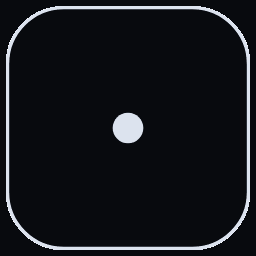
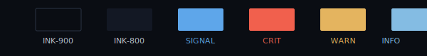

<p align="center">
  
</p>
<p align="center">
  
</p>

# Crittable

*Tabletop exercises for security teams. Roll the inject. Ship the AAR.*

**`ROLL · RESPOND · REVIEW`**

A multi-user, browser-based tabletop platform for incident response.
Open a session, brief the AI, share per-role join links, and Claude
runs the room while your team responds. The after-action report drafts
itself while the room is still warm.

> **Status.** Phase 1 + Phase 2 shipped. Phase 3 in design (Redis pub/sub
> for multi-process WS fan-out, native non-Anthropic LLM adapters).
> Authoritative architecture: [`docs/PLAN.md`](docs/PLAN.md).

## What it does

- **Set the brief.** Scenario / team / environment / constraints in four
  short sections. Claude proposes a plan. You approve or skip.
- **Per-role join links.** HMAC-signed tokens. Kick-and-reissue on demand.
- **Turn-based exercise.** Claude narrates beats, throws injects, yields
  to specific roles via tool calls. Typical session: 30–60 min.
- **Critical-event banners.** Per-role typing indicators. AI auto-interject
  on direct questions.
- **Right-rail HUD.** MGMT Pressure / Containment / Burn Rate gauges
  (placeholders today; real telemetry on the Phase-3 roadmap).
- **Force-advance / abort-turn / proxy-respond escape hatches.**
- **AAR pipeline.** Async, with markdown export, retry, and inline viewer.
- **Operator-tunable everything.** Per-tier model / max_tokens / temperature
  / top_p / timeout, strict-retry count, setup-turn cap, submission cap,
  poll cadences. See [`docs/configuration.md`](docs/configuration.md).
- **Provider swap.** `ANTHROPIC_BASE_URL` → Bedrock / Vertex / OpenRouter
  / local Ollama via litellm. See [`docs/llm_providers.md`](docs/llm_providers.md).

## Quickstart

### GitHub Codespaces

Open the repo in Codespaces. The devcontainer installs both halves.
Add `ANTHROPIC_API_KEY` to your Codespaces secrets and the env var is
forwarded into the container.

### Local Docker (single container)

```bash
docker compose up --build
# visit http://localhost:8000
```

Or directly:

```bash
docker run --rm -p 8000:8000 \
  -e ANTHROPIC_API_KEY="$ANTHROPIC_API_KEY" \
  ghcr.io/nebriv/ai-tabletop-facilitator:latest
```
<!-- TODO: rename to ghcr.io/nebriv/crittable when the image is republished. -->

### Local development (no Docker)

```bash
# Backend
cd backend && pip install -e ".[dev]"
uvicorn app.main:app --reload --app-dir .

# Frontend (separate terminal)
cd frontend && npm ci && npm run dev
```

The frontend dev server proxies `/api` and `/ws` to `localhost:8000` so
the two halves co-develop without CORS friction.

## Session lifecycle (the phase machine)

```
CREATED → SETUP → READY → BRIEFING → AWAITING_PLAYERS ↔ AI_PROCESSING → ENDED
```

Each state has hard rules about which LLM tier may run, which tools may
be called, and what tool-choice posture is forced. Rules live in
[`backend/app/sessions/phase_policy.py`](backend/app/sessions/phase_policy.py)
— a single Python module that the engine assertions, the LLM client's
tool filter, and the dispatcher's runtime checks all consult. See
[`docs/architecture.md`](docs/architecture.md#phase-policy) for the full
table.

The engine does **not** trust the LLM to honor the prompt. Phase
boundaries are enforced in code:

1. Every turn driver entry point asserts the session state matches the
   tier's `allowed_states`.
2. The LLM client filters the `tools` list against the tier's
   `allowed_tool_names` before forwarding to Anthropic.
3. The dispatcher rejects forbidden tool calls at runtime and returns a
   proper Anthropic `tool_result` so the model can self-correct rather
   than retry blind.

## Documentation

- [`docs/PLAN.md`](docs/PLAN.md) — architecture and phase plan (source of
  truth).
- [`docs/architecture.md`](docs/architecture.md) — diagrams, request flows,
  phase policy, retry-feedback loop.
- [`docs/configuration.md`](docs/configuration.md) — every env var,
  defaults, "before going public" hardening checklist.
- [`docs/llm_providers.md`](docs/llm_providers.md) — swap to Bedrock /
  Vertex / OpenRouter / local Ollama via `ANTHROPIC_BASE_URL`.
- [`docs/extensions.md`](docs/extensions.md) — Skills-style custom tools /
  resources / prompts.
- [`docs/prompts.md`](docs/prompts.md) — system-prompt blocks, guardrails,
  tool-use protocol, AAR rubric.
- [`docs/turn-lifecycle.md`](docs/turn-lifecycle.md) — **load-bearing
  reference for the play-turn engine.** Read before touching
  `app/sessions/turn_*` or `app/llm/dispatch.py`.
- [`docs/tool-design.md`](docs/tool-design.md) — **tool authoring
  guidelines.** Read before adding, renaming, or rewording any tool.
- [`CLAUDE.md`](CLAUDE.md) — guidance for Claude Code sessions on this
  repo (six-agent review protocol, logging rules, dependency intake).

## Development

| Goal | Command |
|---|---|
| Backend tests | `cd backend && pytest -q` |
| Backend lint / type | `cd backend && ruff check . && mypy app` |
| Frontend tests | `cd frontend && npm test -- --run` |
| Frontend lint / type / build | `cd frontend && npm run lint && npm run typecheck && npm run build` |

## Brand



Two type families. Operator voice. Square-ish radii. The mark is a d6
whose pips are re-arranged into a 5-on-1 tabletop encounter — five party
tokens, one threat, routes between them. Six encounter states map
optionally to NIST 800-61 IR phases (`CT/01 Detect` … `CT/06 Review`).

Full brand reference: [`design/handoff/BRAND.md`](design/handoff/BRAND.md).
Drop-in tokens + assets: [`design/handoff/`](design/handoff/).

## License

MIT — see [`LICENSE`](LICENSE).
