# Turn lifecycle — gates, validators, and recoveries

> **Why this doc exists**: the play-turn validator is the load-bearing piece of the
> facilitation engine. A single inverted predicate in it broke the entire app on
> 2026-04-30 (AI silently yielded over every player question). This document maps
> every gate, contract, and recovery path in one place so the next regression is
> obvious in seconds, not log-spelunking.
>
> Read this before touching any of: `app/sessions/turn_driver.py`,
> `app/sessions/turn_validator.py`, `app/sessions/phase_policy.py`,
> `app/sessions/slots.py`, `app/llm/dispatch.py`.

## Contents

0. [Vocabulary](#0-vocabulary) — read this first
1. [Entry points — where a turn starts](#1-entry-points)
2. [Session state machine](#2-session-state-machine)
3. [Slot model — what the AI's tool calls map to](#3-slot-model)
4. [Contract picker — what the turn must produce](#4-contract-picker)
5. [Validator decision tree](#5-validator-decision-tree)
6. [Recovery cascade — what happens when validation fails](#6-recovery-cascade)
7. [The 2026-04-30 regression — before/after](#7-the-2026-04-30-regression)
8. [Edge cases and risk surface](#8-edge-cases)
9. [Live verification](#9-live-verification)

---

## 0. Vocabulary

> Read this once. Every later section uses these terms.

### Tier

A class of LLM call. Each tier has its own model, system prompt, tool palette, and
contract. Four exist:

| Tier | When | Tools | Validator runs? |
|---|---|---|---|
| `setup` | Creator setup loop | `ask_setup_question`, `propose_scenario_plan`, `finalize_setup` | No — own loop. |
| `play` | Driving the exercise (this doc) | `broadcast`, `address_role`, `share_data`, `pose_choice`, `set_active_roles`, `inject_critical_event`, `end_session`, `request_artifact`, `track/resolve_role_followup`, `lookup_resource`, `use_extension_tool` | **Yes** — the focus of this doc. |
| `aar` | After-action report generation | `finalize_report` only | No — `tool_choice` pinned. |
| `guardrail` | Pre-flight off-topic / harmful classifier | classifier tool only | No. |

### Slot

A category of work the AI did on a turn. **Every play tool maps to exactly one
slot.** The validator inspects the *set of slots that fired* (across all attempts
on the turn, merged via union); contracts say which slots are required vs
forbidden. See §3 for the full map.

| Slot | Meaning | Produced by |
|---|---|---|
| `DRIVE` | Player-facing message — answer or brief | `broadcast`, `address_role`, `share_data`, `pose_choice` |
| `YIELD` | Advances the turn to the next active roles | `set_active_roles` |
| `TERMINATE` | Ends the exercise (kicks AAR) | `end_session` |
| `NARRATE` | System note (gray text) | `inject_event` *(removed from active palette 2026-04-30; dispatcher handles as dead code)* |
| `PIN` | Right-sidebar timeline pin (no chat bubble) | `mark_timeline_point` *(removed from active palette 2026-04-30; dispatcher handles as dead code)* |
| `ESCALATE` | Critical-event banner | `inject_critical_event` |
| `BOOKKEEPING` | Engine-side tracking only — no player effect | `track/resolve_role_followup`, `request_artifact`, `lookup_resource`, `use_extension_tool` |

### Contract

A `frozen` declarative spec saying what slots a turn *must* contain (`required_slots`)
and what slots it *must not* contain (`forbidden_slots`). Three live in the codebase:

| Contract | required | forbidden | Used when |
|---|---|---|---|
| `PLAY_CONTRACT_NORMAL` | `{DRIVE, YIELD}` | `{}` | Mid-exercise yielding turn (state ≠ BRIEFING). |
| `PLAY_CONTRACT_BRIEFING` | `{DRIVE, YIELD}` | `{}` | First play turn after `/start`. Hard-required DRIVE. |
| `PLAY_CONTRACT_INTERJECT` | `{DRIVE}` | `{YIELD, TERMINATE}` | Side-channel `?`-answer that mustn't advance the turn. |

A turn is **valid** under its contract iff every required slot fired AND no forbidden
slot fired.

### Validator

The pure function `validate(session, cumulative_slots, contract, …)`. Reads the
session transcript + the slot set + the contract; emits zero-or-more
**recovery directives** (one per violation) plus zero-or-more **warnings** (soft
mismatches). No I/O, no state writes — trivial to unit-test.

### Recovery directive

A recipe for one follow-up LLM call when validation fails. Each directive carries:

| Field | What it controls |
|---|---|
| `kind` | Symbolic label, e.g. `"missing_drive"`, `"missing_yield"` (logged + WS-broadcast as a status). |
| `tools_allowlist` | The exact set of tool names the model is permitted to emit on this attempt. Other tools are not even sent to the API. |
| `tool_choice` | Anthropic `tool_choice` parameter — `{"type":"tool","name":"..."}` forces the model to call exactly that tool. |
| `system_addendum` | Extra system-message block appended to the regular play prompt for this attempt. |
| `user_nudge` | A `[system] ...` line spliced into the recovery user-message after the prior tool-loop, telling the model what to do. |
| `priority` | When multiple directives fire, lowest priority runs first. DRIVE = 10, YIELD = 20. |
| `replays_prior_tool_loop` | If `True` (always, in this codebase), the prior attempt's `tool_use` blocks + the dispatcher's `tool_result` blocks are spliced into the messages array so the model sees what it just did and can self-correct. |

### Recovery cascade

The driver loop in `run_play_turn` that runs **one directive per attempt**, lowest
priority first, accumulating slots across attempts via union. The shared budget is
`1 + LLM_STRICT_RETRY_MAX` (default 3). On each attempt the validator re-runs
against the *cumulative* slot set, so a DRIVE produced on attempt 1 still satisfies
the contract on attempt 2 even if attempt 2 only emits YIELD. See §6.

### Kill-switch

A boolean env var that lets an operator opt out of new validator behavior in an
emergency. Two exist (see §4) — both should remain at their defaults in production.

### Phase policy

A separate module (`app/sessions/phase_policy.py`) that controls **authorization**:
"is this LLM call permitted in this state?" and "is this tool allowed on this tier?"
Distinct from the validator (which controls **completeness**: "did this turn produce
valid output?"). Phase policy never imports the validator and vice-versa.

---

## 1. Entry points

> **Wave 1 (issue #134) — per-submission intent + ready-quorum gate.** The
> ``AWAITING_PLAYERS → AI_PROCESSING`` flip no longer happens when every
> active role has *submitted at least once*; it now happens when every
> active role has signalled ``intent="ready"`` on a recent submission
> (or the creator force-advances). A submission with ``intent="discuss"``
> contributes to the transcript and adds the role to ``submitted_role_ids``
> but does **not** trip the gate; a follow-up ``intent="ready"`` adds the
> role to ``Turn.ready_role_ids``, and a follow-up ``intent="discuss"``
> walks them back. ``can_submit`` now allows multiple submissions per
> active role on an awaiting turn (drops the one-and-done cap) — every
> such submission is a turn submission, not an interjection. The wire
> field is REQUIRED on the WS ``submit_response`` payload; the handler
> rejects payloads without ``intent`` rather than coercing to a default.

Five paths can fire a play turn. Knowing which path you're on determines which
contract gets picked and which guard rails apply.

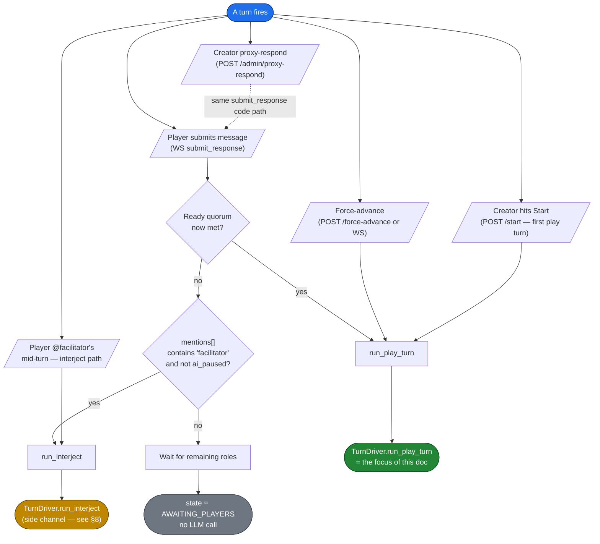

### Rules of thumb per entry

| Entry | State going in | Triggers | Notes |
|---|---|---|---|
| Player submits last response | `AWAITING_PLAYERS` → `AI_PROCESSING` | `run_play_turn` | Only the submission that closes the ready quorum triggers the call. Earlier submitters just queue. |
| Force-advance | `AWAITING_PLAYERS` → `AI_PROCESSING` | `run_play_turn` | Inserts `[system] Force-advanced by X; missing voices skipped`. |
| `/start` | `READY` → `BRIEFING` → `AI_PROCESSING` | `run_play_turn` (briefing contract) | The first play turn uses `PLAY_CONTRACT_BRIEFING` — no soft carve-out. |
| Proxy-respond | Same as submit | Same as submit | Creator types on behalf of an absent role; same code path including the structural `mentions[]` validation. |
| **`@facilitator` mid-turn (active asker)** (Wave 2) | `AWAITING_PLAYERS` (stays) | `run_interject` | Player typed `@facilitator` (or alias `@ai` / `@gm` resolved client-side) in the composer. Side channel; doesn't advance the turn; uses its own contract (see §8). Suppressed when `Session.ai_paused=True` (Wave 3 stub) — the message still lands in the transcript with the @-highlight, but the AI does NOT respond. |
| **Out-of-turn `@facilitator` interjection (issue #78 + Wave 2)** | `AWAITING_PLAYERS` (stays) | `run_interject` | A non-active role (or already-submitted active role) `@facilitator`s. Same `run_interject` path as the active-asker case; the asker's role_id is threaded through `for_role_id` and exposed to the model in a per-call system note. |
| **Plain `@<role>` mention** (Wave 2) | `AWAITING_PLAYERS` (stays) | none — transcript-only | Player addressed a teammate, not the AI. Message lands in the transcript with the @-highlight rendered for the addressed role from `Message.mentions[]`; no AI side effect. The next `run_play_turn` reads the body as context. |
| **Out-of-turn comment** (issue #78) | `AWAITING_PLAYERS` (stays) | none — transcript-only | A non-active role (or already-submitted active role) posts text without `@facilitator`. The message lands in the transcript with `is_interjection=True` (rendered to the model with an `[OUT-OF-TURN]` prefix); no LLM call fires. The next normal `run_play_turn` reads it as context and Block 6 of the play prompt instructs the model not to add the speaker to `set_active_roles`. |

> **The inverted carve-out only ever applied on the `run_play_turn` path.**
> `run_interject` has its own narrowed tool surface and never silently yields.

> **Issue #78 contract:** a non-active role's submission NEVER mutates
> `submitted_role_ids`, NEVER advances the turn, NEVER changes
> `active_role_ids`. It only appends a `MessageKind.PLAYER` row with
> `is_interjection=True`. The state machine is preserved.

### 1a. Player-submission pipeline (single source of truth)

Every player submission — whether it arrives via `submit_response` over
the WebSocket, or via the dev-tools scenario runner replaying a recording
— goes through `app/sessions/submission_pipeline.py::prepare_and_submit_player_response`.
This is a load-bearing seam: both call sites MUST use it so a regression
in any input-side gate trips a replayed scenario before production.

The pipeline does, in order:

1. **Empty-content check** → `EmptySubmissionError` (caller decides:
   WS handler emits `error` frame, runner logs + skips).
2. **Length-cap truncation** → if `len(content) > max_participant_submission_chars`,
   slice and append the `[message truncated by server]` marker (so the
   AI doesn't read a clipped sentence as a real fragment).
   `outcome.truncated=True` and `outcome.original_len` let the WS handler
   emit a `submission_truncated` info frame.
3. **`mentions[]` validation** (Wave 2) → ``_validate_mentions`` drops
   any entry that isn't either a current `role_id` on the session or
   the literal `"facilitator"` token. Non-string / empty entries are
   dropped. The list is capped at `_MENTIONS_CAP = 16` entries; excess
   is truncated. Drops emit a `mention_dropped` WARNING audit with
   `submitted` / `dropped` / `kept` so an operator can debug a "the AI
   didn't pick up my @-mention" report from the audit log alone. The
   cleaned list is what `submit_response` persists on
   `Message.mentions` and what the WS routing branch reads to decide
   whether to fire `run_interject`.
4. **Input-side guardrail classification** → only `prompt_injection`
   blocks. `outcome.blocked=True`, `submit_response` is NOT called, and
   the message never lands in the transcript. The WS handler emits a
   `guardrail_blocked` info frame; the runner just logs.
5. **`manager.submit_response`** → records the message with its
   `intent` + cleaned `mentions[]`, mutates `submitted_role_ids` if
   the role is active, updates `ready_role_ids` based on intent
   (Wave 1 — see § 1c below), flips state to `AI_PROCESSING` when
   the ready-quorum gate closes. The dedupe window lives inside
   `submit_response` itself, so both call sites inherit it.

### 1c. Per-submission intent + ready-quorum gate (Wave 1, issue #134)

Wave 1 (PR #148) replaced the implicit *"AI advances when every
active role has submitted at least once"* predicate with an explicit
per-submission **intent** signal. Every WS `submit_response` payload
must carry `intent: "ready" | "discuss"`; the handler rejects missing
or malformed values with a `submit_response` error frame (no silent
default — see CLAUDE.md "no backwards compat").

| Intent | Effect on `Turn.ready_role_ids` | Effect on `Turn.submitted_role_ids` |
|---|---|---|
| `"ready"` | Role added (if not already) | Role added (if not already) |
| `"discuss"` | Role removed (if present) — walks back ready | Role added (if not already) |

The state-flip predicate moves from `all_submitted(turn)` to
`all_ready(turn)` — i.e. `set(active_role_ids) ⊆ set(ready_role_ids)`.
Force-advance still bypasses this check (operator escape hatch
preserved).

**`can_submit` widened.** Active roles can now post **any number of
submissions on an awaiting turn** before signalling ready. Pre-Wave-1
the second message from an active role was treated as an
out-of-turn interjection; under the ready-quorum model every
submission from an active role on an awaiting turn is a turn
submission. Out-of-turn behavior (issue #78) is preserved — a
non-active role's message still lands as an interjection regardless
of intent (which is recorded as `None` on the resulting `Message`).

**Briefing turn unaffected.** The opening turn fires from `/start` →
`start_session`, which never calls `submit_response`. Briefing
plays through `run_play_turn` against an empty active-set turn the
runner pre-creates; only post-briefing `AWAITING_PLAYERS` turns gate
on the ready quorum.

**Recorder + replay.** `Message.intent` is recorded on every player
turn submission; the `SessionRecorder` round-trips it onto
`PlayStep.intent` (default `"ready"` for legacy / pre-Wave-1
recordings). The `ScenarioRunner` threads `intent` through
`prepare_and_submit_player_response` in both engine and deterministic
modes.

**Audit trail.** `response_submitted` / `interjection_submitted` /
`proxy_submit_as` audit lines all carry `intent`, `ready_role_ids`,
and `submitted_role_ids` snapshots. The `message_complete` WS
broadcast also includes `intent` so connected clients can render a
"discussing" affordance per-message without re-fetching the
snapshot. A walk-back from ready emits a dedicated
`ready_walk_back` audit line (operator-visible signal for griefing
detection).

**Frontend wiring.** `Composer.tsx` exposes a two-button submit
("SUBMIT & READY →" primary / "STILL DISCUSSING →" secondary,
relabelling to "UNREADY ↺" when the player is currently ready).
`Enter` maps to `ready`; `Ctrl/Cmd+Enter` maps to `discuss` so
keyboard-only operators can pick the discussion path. Out-of-turn /
proxy-off-turn composers hide the secondary button (intent doesn't
apply when the message lands as an interjection). The `WaitingChip`
HUD reads from `current_turn.ready_role_ids` and shows
"Waiting on X to mark ready (N of M ready)" with a "discussing"
annotation for roles who have spoken but not yet readied.

What's deliberately **NOT** in the pipeline:

- WS framing / origin check / token-version check at upgrade time —
  those are connection-level gates the WS handler enforces before
  `event_type == "submit_response"` is even read. The runner is
  in-process and uses the manager directly; there's no socket to
  authenticate.
- `run_play_turn` / `run_interject` post-submission dispatch — those
  are tier-specific. The deterministic-replay path skips both
  intentionally; engine-mode replay still calls `run_play_turn` after
  `outcome.advanced` flips True.

**If you're adding a new input-side gate** (a new validator, a new
classifier, anything between "the user typed something" and "it lands
in `session.messages`"), put it in `submission_pipeline.py`. Otherwise
it'll only fire on the WS path and a recorded-then-replayed regression
won't catch it. There's a regression-net test —
`tests/test_submission_pipeline.py` for the unit boundary, and
`tests/scenarios/test_scenario_runner.py::test_runner_routes_player_submissions_through_pipeline`
for the runner-level proof — that locks the contract.

---

## 2. Session state machine

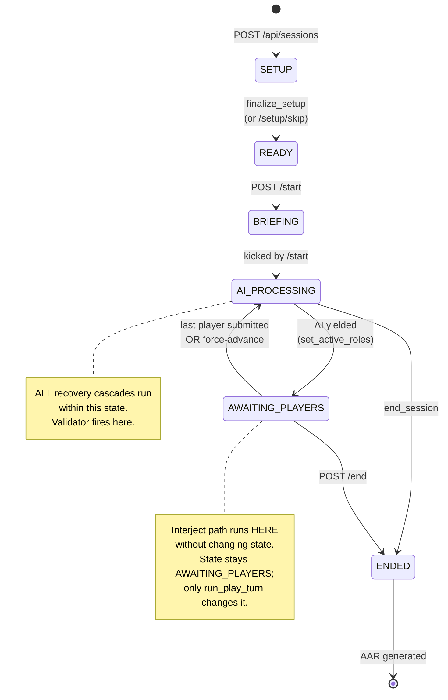

### What this means for the validator

- The validator **only ever runs while state is `AI_PROCESSING`**.
- The contract picker uses `session.state` to choose `BRIEFING` (first turn after `/start`)
  or `NORMAL` (every other yielding turn).
- The legacy soft-drive carve-out only applied to `PLAY_CONTRACT_NORMAL` — `BRIEFING` and
  `INTERJECT` always hard-required DRIVE.

---

## 3. Slot model

Every play tool is mapped to exactly one **slot** (the work-category it represents).
The validator reads cumulative slots across the whole turn (all attempts merged via
union); contracts say which slots are required vs forbidden.

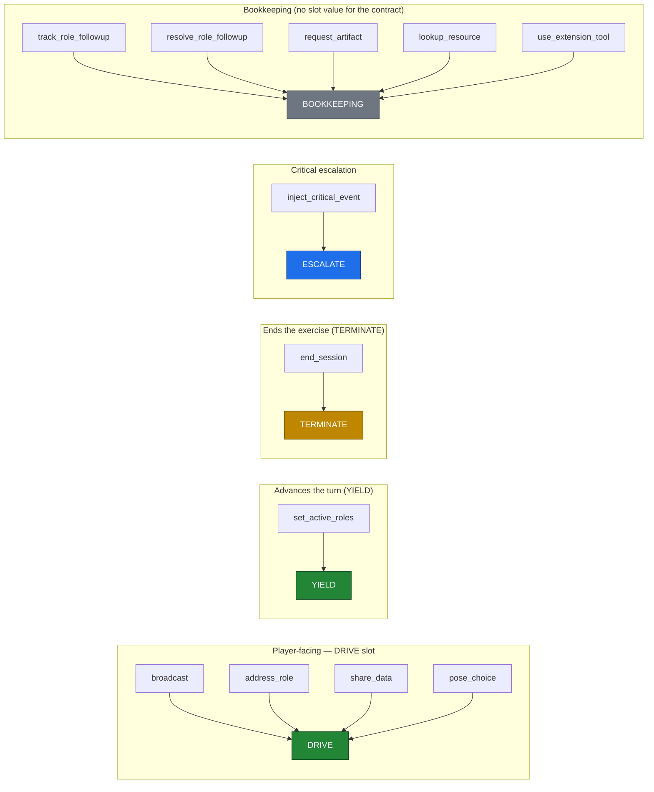

> **Tool palette redesign (2026-04-30):** `inject_event`,
> `mark_timeline_point`, and `record_decision_rationale` were removed
> from `PLAY_TOOLS`. They were perpetual "do something easy and stop"
> attractors. `share_data` (synthetic data dumps for IOCs/logs/telemetry)
> and `pose_choice` (multi-choice tactical decisions) replaced their
> legitimate use cases. Rationale is now harvested from the model's
> natural text content blocks. See [`tool-design.md`](tool-design.md)
> for the case studies.

### The two slots that matter for this regression

| Slot | What it means | Contract role |
|---|---|---|
| **DRIVE** | The AI gave the active roles a player-facing message: an answer, a brief, a question, a redirect. The thing players need to read to know what to do next. | Required by every yielding play turn (post-fix). |
| **YIELD** | The AI advanced the turn by naming the next active roles. | Required by every play turn (or `TERMINATE` instead). |

> **The 2026-04-30 bug** was that `record_decision_rationale` (BOOKKEEPING) was being
> treated as "the AI did something" — but BOOKKEEPING never satisfies DRIVE. The
> validator correctly noticed DRIVE was missing; the *carve-out* incorrectly
> downgraded that violation to a warning when a player's message ended in `?`.

---

## 4. Contract picker

`contract_for(tier, state, mode, drive_required)` picks the contract for the
turn before the validator runs.

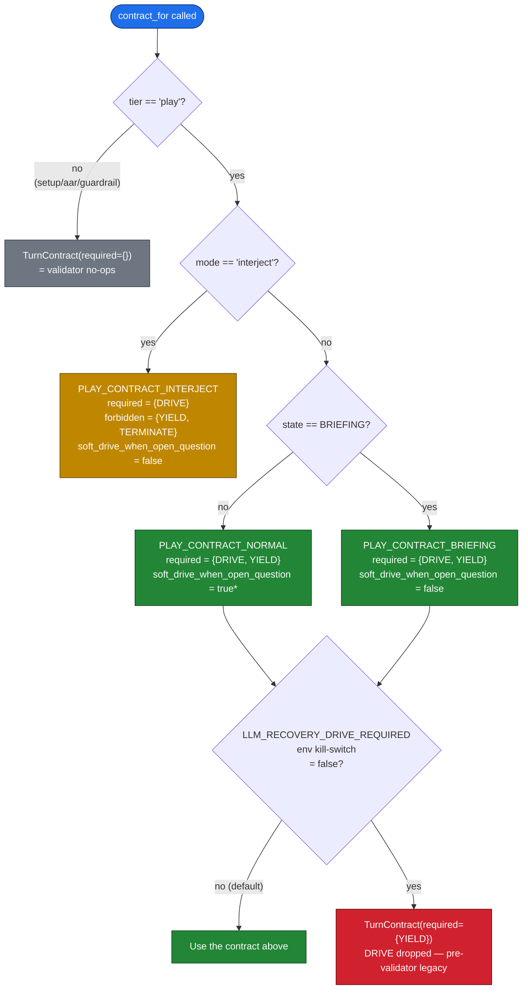

> *`soft_drive_when_open_question = true` on `PLAY_CONTRACT_NORMAL` is **only the
> per-contract opt-in**. The actual carve-out also requires the operator-level
> `LLM_RECOVERY_DRIVE_SOFT_ON_OPEN_QUESTION` env var to be true. **Both** must be
> true for the carve-out to fire. As of this commit the env var defaults to false,
> which means the carve-out is dead by default. See §5.

### Two operator kill-switches, distinct purposes

| Env var | Default | What flipping it ON does |
|---|---|---|
| `LLM_RECOVERY_DRIVE_REQUIRED` | `true` | Drops DRIVE from the required set entirely. Reverts to pre-validator "yield-only" semantics. Use only for an emergency rollback to the very old behavior. |
| `LLM_RECOVERY_DRIVE_SOFT_ON_OPEN_QUESTION` | `false` | Re-enables the legacy soft-drive carve-out (the **buggy** one). Causes silent yields on player `?`-questions again. **Do not enable in production.** |

A startup warning fires (boot log: `legacy_carve_out_enabled`) if the second flag is
ever turned on.

---

## 5. Validator decision tree

This is the function whose inverted predicate caused the regression. It is a
**pure function** — no I/O, no state writes — making it trivial to unit-test.

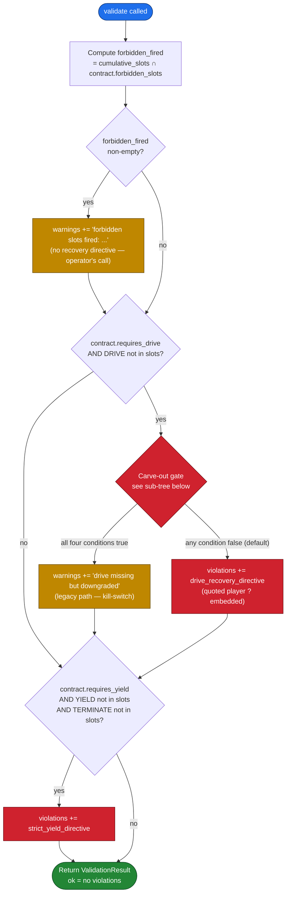

### 5a. The carve-out sub-tree (default-disabled)

This is the **only** place a missing DRIVE is permitted. All four conditions must be
true; if any are false, recovery fires.

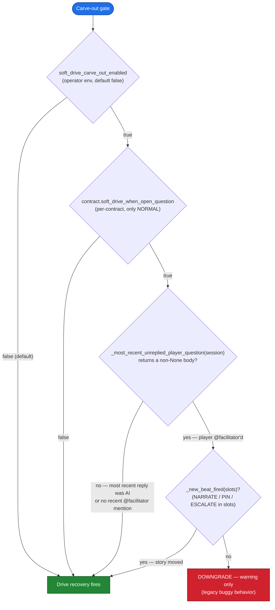

> **Why the carve-out is wrong** (the heart of the regression):
> The third condition fires on an unanswered ``@facilitator`` mention.
> The carve-out's stated intent was "the AI's prior question is still
> open and players are mid-discussion answering it." But the predicate
> matches the *player asking the AI* a question. So the carve-out was
> downgrading the violation **exactly when the AI was required to
> answer** — the inverse of its intent. Default-disabling it removes
> the failure mode entirely, and the explicit Pause-AI control
> (Wave 3) is the correct way to permit player-only discussion.

### 5b. What `_most_recent_unreplied_player_question` returns

Walks the transcript backwards. Returns the message body string if the
most-recent non-AI-broadcast/non-AI-address_role event is a player
message that carried an ``@facilitator`` mention. Otherwise returns
`None`. (Wave 2 swapped the trailing-`?` heuristic for the structural
mention signal — see § 1a.)

| Transcript head (newest last) | Return value |
|---|---|
| `… AI:broadcast(…), Player:"contained"` (no mentions) | `None` |
| `… AI:broadcast(…), Player:"@facilitator what do we see?"` | The body |
| `… Player:"@facilitator …", AI:broadcast("yes — …")` | `None` (AI already replied) |
| `… AI:broadcast("act now?"), Player:"isolating"` (no mentions) | `None` |

This same function is now **also** used to ground the drive-recovery
user nudge — when DRIVE recovery fires and a player ``@facilitator``
mention exists, its body is embedded verbatim in the recovery prompt
so the model can't broadcast a generic "what's the move?" to satisfy
the slot.

---

## 6. Recovery cascade

When validation fails, the driver runs **one directive per attempt**, lowest
`priority` first. Slots accumulate across attempts via union.

### Two directives in priority order

| Directive | Priority | Tools allowed | `tool_choice` | What it tells the model |
|---|---|---|---|---|
| `drive_recovery_directive` | **10** | `{"broadcast"}` | `{"type":"tool","name":"broadcast"}` | "Issue a broadcast that (1) answers the open player `?` first, (2) briefs the next decision. Block 4 hard boundaries still apply (no plan disclosure)." When called with `pending_critical_inject_args=...` (issue #151 fix B), the system addendum prepends the inject's severity/headline/body and the user nudge embeds the headline so the recovery broadcast leads with the inject rather than a generic next-beat brief. |
| `strict_yield_directive` | **20** | `{"set_active_roles"}` | `{"type":"tool","name":"set_active_roles"}` | "Just emit `set_active_roles` and stop. The brief already landed; this is the one path where Block 6's silent-yield prohibition is overridden." |

### The compound-violation cascade (sequence)

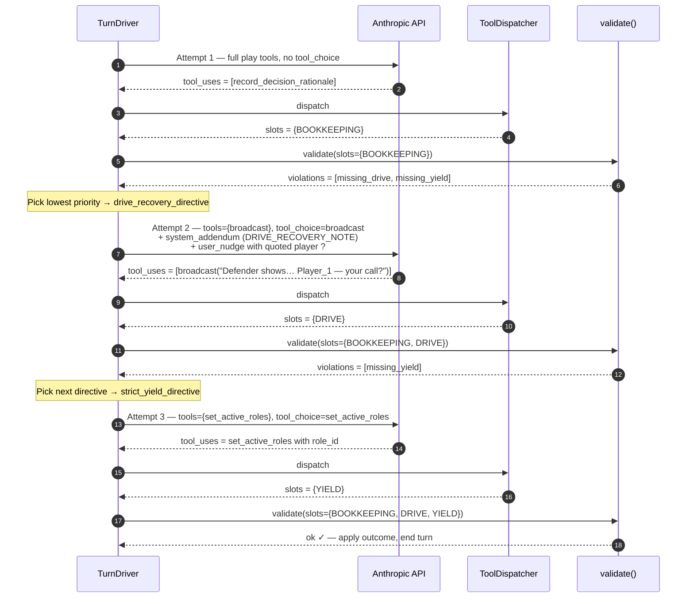

### Budget exhaustion fallback

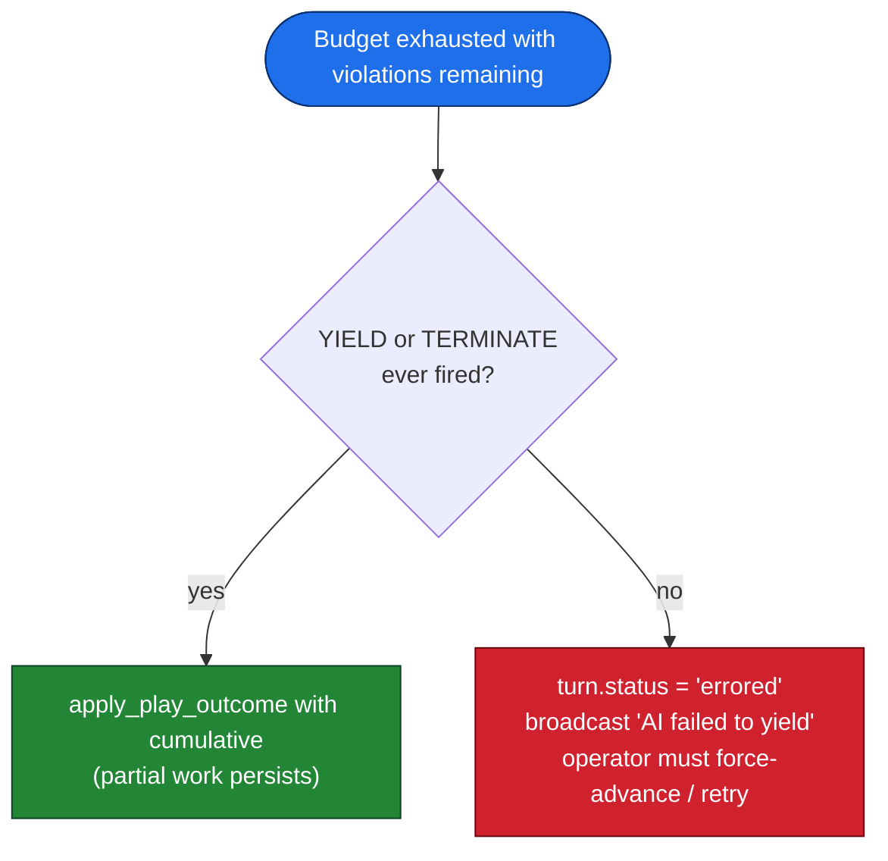

### Why exactly two recovery slots in the budget

`LLM_STRICT_RETRY_MAX` defaults to **2**, giving a total budget of `1 + 2 = 3`
attempts. The worst case is exactly the cascade above: attempt 1 produces nothing
useful, attempt 2 = drive recovery, attempt 3 = yield recovery. Lifting the budget
costs LLM dollars; lowering it makes the engine fragile to one bad attempt.

---

## 7. The 2026-04-30 regression

Captured production trace from session `e4d6503317d6`, turn 3. SOC Analyst asked:
> *"Yeah we can pull account activity via Defender. **What do we see?**"*

The AI emitted only `record_decision_rationale` — no broadcast, no yield. Below is
the decision path under both the buggy and the fixed validator.

### Side-by-side flows

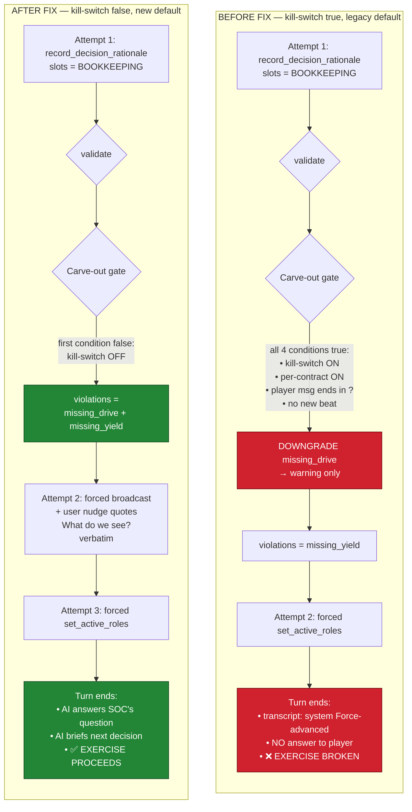

### What changed in this commit

| Where | Change | Why |
|---|---|---|
| `app/config.py` `llm_recovery_drive_soft_on_open_question` | Default `True` → `False` | Disables the carve-out by default. |
| `app/main.py` lifespan | Emit startup warning if the kill-switch is still on | Operability — never lose the carve-out's existence in a flag toggle. |
| `app/sessions/turn_validator.py` `validate()` | Default of `soft_drive_carve_out_enabled` flipped to `False` | Mirror the prod default at the function level so unit tests see the same behavior unless they opt in. |
| `app/sessions/turn_validator.py` `_DRIVE_RECOVERY_NOTE` | Added "answer the open `?` first" + Block-4 plan-disclosure defense | Make the recovery broadcast actually answer the question and not be coercible into plan disclosure. |
| `app/sessions/turn_validator.py` `drive_recovery_directive(pending_player_question=…)` | Verbatim quoting in user nudge | Grounds the recovery so the model can't satisfy DRIVE with a generic broadcast. |
| `app/sessions/turn_validator.py` helper rename | `_open_player_question` → `_most_recent_unreplied_player_question` | Returns the body for grounding; old boolean wrapper retained for the kill-switch path. |
| `app/llm/prompts.py` Block 6 | Removed "yielding silently is fine" sentence; replaced with "always pair broadcast/address_role with set_active_roles" | The prompt no longer encourages the broken behaviour. |
| `app/llm/prompts.py` `_STRICT_YIELD_NOTE` | Added "this is the one exception to silent-yield prohibition" sentence | Resolve the apparent contradiction between Block 6 and the strict-yield recovery. |
| `app/llm/prompts.py` `_ROSTER_STRATEGY["large"]` | "Every regular turn ends with a broadcast/address_role" | Clarify the every-3-4-turn summary is *additional*, not a replacement. |
| `docs/configuration.md` | Updated default and explanation | Future operators understand why the kill-switch exists and why not to flip it. |
| `backend/tests/test_turn_validator.py` | New tests + renamed legacy ones | Kill-switch behaviour, dynamic user nudge, verbatim quoting, edge cases. |
| `backend/tests/test_e2e_session.py` | New high-fidelity regression test | Replays the captured production scenario; asserts cascade + verbatim quote + Block-4 reference. |

---

## 8. Edge cases

The validator and recovery loop have to handle a long tail of "what if" cases.
Each has been verified by reading the code top-down and (where applicable) by a
unit test.

### 8a. Briefing turn (first play turn)

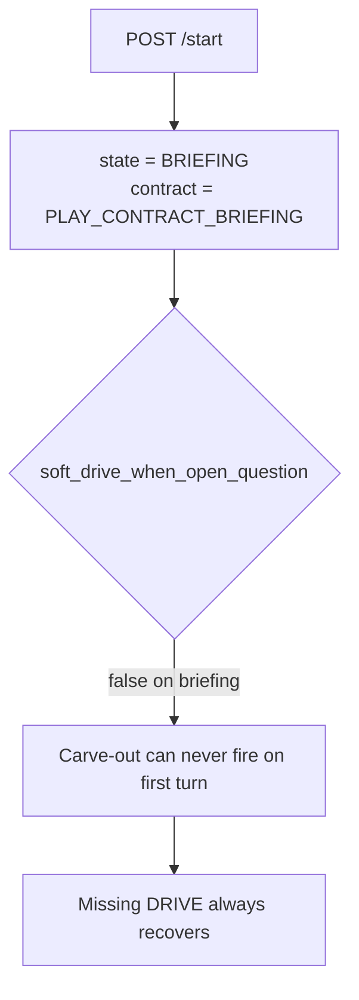

Why it matters: there is no "open `?`" possible on turn 1 (no prior player
messages), but defense-in-depth keeps the briefing contract immune even if the
state machine were ever broken.

### 8b. End-session turn

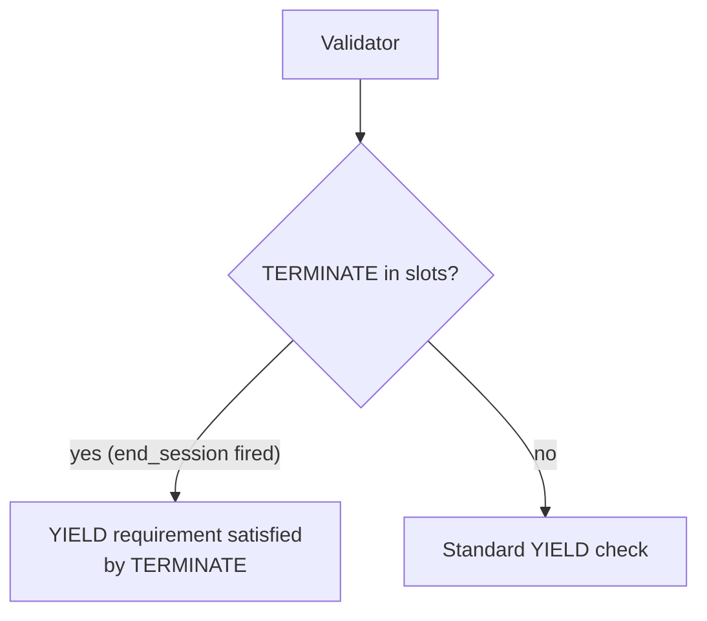

`end_session` substitutes for `set_active_roles` — the AAR pipeline is what players
see next, no need to name active roles.

### 8c. Critical inject

`inject_critical_event` is rate-limited (default: 1 per 5 turns). The model is also
required by Block 6 to follow it with `broadcast` + `set_active_roles` in the same
turn. Four layers defend against the model forgetting the broadcast (issue #151):

1. **Block 6 prompt rule** — "Critical-inject chain (mandatory)" tells the model to
   always pair the inject with an actor-naming tool. Real-model conformance is
   ~30–50% on this fixture (measured via `backend/scripts/issue_151_before_after.py`).
2. **Dispatch-time pairing scan (fix A, pre-dispatch)** — when the dispatcher sees
   `inject_critical_event` without a same-batch actor-naming tool (`broadcast`,
   `address_role`, `pose_choice`; `share_data` is excluded — a raw data dump can
   satisfy the DRIVE slot without telling anyone WHO to act), the inject is rejected
   with `is_error=True` carrying a structured chain-shape hint. The banner does NOT
   fire. The strict-retry loop replays the error so the model self-corrects on the
   cheaper layer (no extra recovery LLM calls). See `_INJECT_PAIRING_TOOL_NAMES` in
   `app/llm/dispatch.py`.
3. **Post-dispatch slot-pairing rollback (fix A, post-dispatch)** — the pre-dispatch
   scan only checks tool *names*. If a paired tool fires by name but later fails its
   own validation (e.g. `address_role(role_id="bogus")` raises for unknown role),
   the DRIVE slot never lands but the inject did. The post-dispatch check inspects
   `outcome.slots`: if `Slot.ESCALATE in slots` and `Slot.DRIVE not in slots`,
   `_rollback_inject` retroactively rejects the inject (drops the slot, strips the
   CRITICAL_INJECT message, rewrites the tool_result as `is_error=True`). The
   `critical_event` WS broadcast is deferred to `_apply_play_outcome` so the rollback
   runs BEFORE the banner reaches clients — no retract event needed.
4. **Inject-grounded DRIVE recovery (fix B)** — if either dispatch-layer check
   fires (or some path lets a solo inject through), the dispatcher captures
   `outcome.critical_inject_attempted_args` regardless of success/rejection. The
   turn validator passes that into `drive_recovery_directive(pending_critical_inject_args=…)`
   which prepends the inject's `severity`/`headline`/`body` to the system addendum
   AND embeds the headline in the user nudge. Pre-fix, the recovery prompt was
   generic and the model would broadcast a vanilla next-beat brief that ignored the
   inject (~40% leading-with-inject). Post-fix, every recovery announces the inject
   as the lead (100% leading-with-inject). The directive `kind` stays
   `"missing_drive"` for backward compat; operators distinguish via the
   `drive_recovery_grounded_on_inject` log line emitted by `turn_driver.run_play_turn`
   at the validation consumption site (`validate()` itself stays a pure function).

Adding a new "this tool requires a same-batch X" pairing rule: extend the
`inject_pairing_violation` scan in `dispatch()` and add the new tool's branch in
`_handle()`. Add a regression test in `backend/tests/test_dispatch_tools.py`
mirroring `test_inject_critical_event_rejected_when_unpaired` AND the post-dispatch
rollback test `test_inject_rolled_back_when_paired_drive_tool_fails_validation`.

### 8d. Force-advance

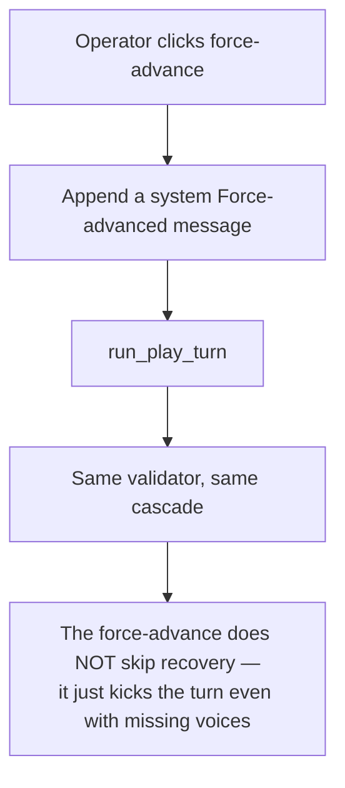

### 8e. Interject (side channel)

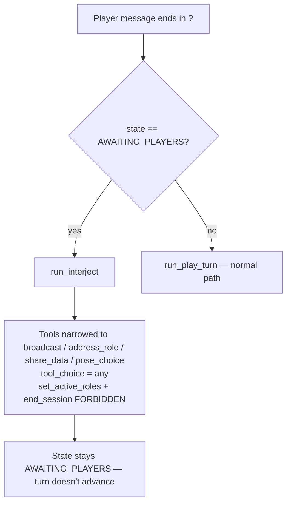

Interject uses its own contract (`PLAY_CONTRACT_INTERJECT`): forbids YIELD + TERMINATE,
requires DRIVE, and never has the soft carve-out enabled. The 2026-04-30 bug never
affected this path.

### 8f. Recovery itself produces nothing

If the model returns no tool calls on attempt 2 (broadcast pinned), DRIVE still
isn't produced. Validation re-fires; the cascade tries again with the next
directive (or runs out of budget). Worst case: budget exhausted with only
BOOKKEEPING in the cumulative slot set → turn errored, operator sees a banner.

### 8g. Forbidden slot fired (interject yielded)

If the AI calls `set_active_roles` during `run_interject`, the dispatcher's
phase-policy check rejects it before it reaches the validator. The model sees
`is_error=true` on the next `tool_result` and self-corrects on the strict-retry
pass.

### 8h. Multiple drive tools on one turn

If the AI calls both `broadcast` AND `address_role` in one turn, both fire DRIVE
(slot is a set, so it's just `{DRIVE}` either way). The validator passes. No
double-counting.

### 8i. The kill-switch is flipped on after deploy

A startup warning fires (`legacy_carve_out_enabled` log line) so the next operator
knows. The carve-out re-activates and the regression returns. The legacy unit tests
still pass with `soft_drive_carve_out_enabled=True` explicitly to lock the path's
behaviour. **This is intentional** — emergency rollback shouldn't require code
changes.

### 8j. Player message with `?` but addressed to another player

Pre-fix: caused silent yield (the bug).
Post-fix: AI broadcast fires, addressing the question. If the question was not
actually for the AI (e.g. "CISO, what do you want to do?"), the AI's broadcast
will acknowledge that and redirect — which is fine UX. The Phase-B Pause-AI
control will give operators a clean way to step back when player-to-player
discussion is genuinely wanted.

---

## 9. Live verification

The unit + e2e suites cover validator behavior against mocked Anthropic responses.
To verify the **real model** also produces well-formed outputs under the new
prompt, run `backend/scripts/live_recovery_check.py` (added in this commit).
Requires `ANTHROPIC_API_KEY`:

```bash
cd backend && python scripts/live_recovery_check.py
```

### What the script does

| # | Check | What's exercised |
|---|---|---|
| 1 | Normal play turn (full palette, no `tool_choice`) | **Informational.** Does the model attempt-1 the full shape (DRIVE + YIELD in one response)? |
| 2 | Drive recovery (tools = `{broadcast}`, `tool_choice` pinned, prior `record_decision_rationale` tool-loop spliced in, recovery user nudge with the verbatim player `?`) | **Pass criterion.** Broadcast must reference the source of the question (e.g. "Defender", "account activity"). |
| 3 | Yield recovery (tools = `{set_active_roles}`, `tool_choice` pinned) | **Pass criterion.** `set_active_roles` must return valid role IDs. |

### Live result observed during this commit (2026-04-30)

```
[1/3] normal play turn — model emitted ['record_decision_rationale',
      'mark_timeline_point', 'inject_event'] — needs_recovery
[2/3] drive recovery   — broadcast cited the Defender telemetry verbatim — PASS
[3/3] yield recovery   — yielded to ['role-ciso', 'role-soc']         — PASS
```

This is **production-correct**. The model on this transcript naturally tends to
emit only stage-direction tools on attempt 1 (the same pattern seen in the
original production trace — see §7). The validator catches it; drive recovery +
yield recovery rescue it. End-state is identical to a clean attempt-1 turn.

### Why this matters

The 2026-04-30 regression slipped through the unit + e2e suites because they
used a hand-rolled mock transport returning canned `tool_use` blocks — the real
model's interpretation of the prompt was never observed. This script closes that
loop. **Run it before pushing any change** to: `_DRIVE_RECOVERY_NOTE`,
`_STRICT_YIELD_NOTE`, `_format_drive_user_nudge`, Block 6 of `prompts.py`, or
the `drive_recovery_directive` plumbing.

The script exits 0 if checks 2 + 3 pass (regardless of check 1). Only checks
2 + 3 are pass/fail — the cascade is the load-bearing fix; check 1 just measures
how often it activates.


